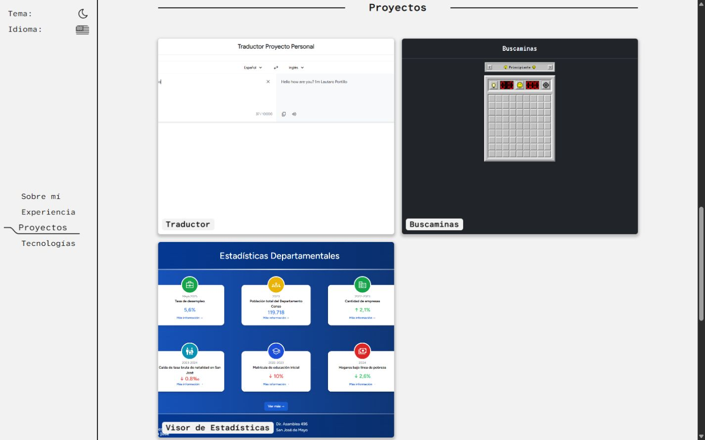
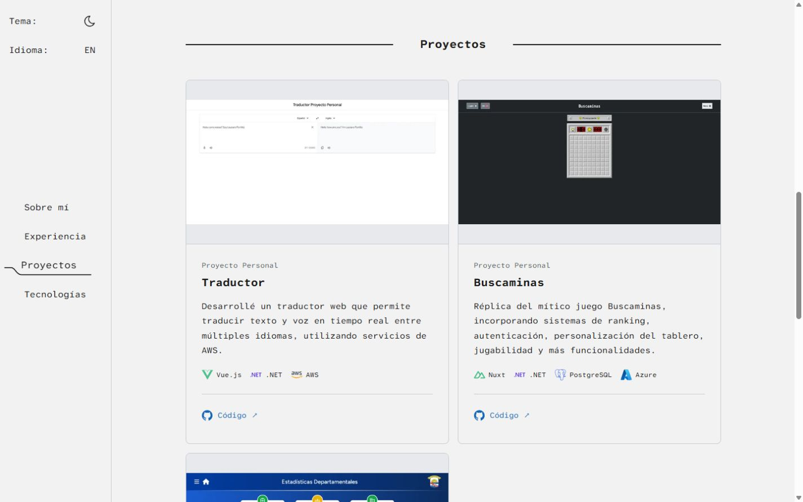

# Revisión del portafolio — 19 de septiembre de 2026

Se implementó una evolución del sitio existente, sin cambiar Astro, Tailwind, las rutas de idioma, el contenido profesional ni los enlaces externos. No se desplegó ni se modificaron servicios externos. Los cambios previos en `comando.txt` y `package-lock.json` se conservaron.

## Diagnóstico y decisiones

La inspección incluyó el sitio publicado, sus cuatro secciones, el giro de proyectos, la navegación móvil y la versión inglesa. El contenido y la composición de `/es/` local coincidían con producción. Se ejecutó una compilación inicial antes de intervenir.

Se conservaron la firma con sintaxis de código, el retrato, la fuente Atkinson Hyperlegible Mono, los acentos azul/naranja, la navegación lateral y su indicador, los temas claro/oscuro, el orden de las secciones y todos los proyectos y tecnologías. Estos elementos ya daban una identidad reconocible y una estructura fácil de comprender.

| Observación inicial | Intervención y beneficio | Comprobación |
| --- | --- | --- |
| Los proyectos ocultaban descripción, stack y enlaces detrás de tarjetas giratorias sin control de teclado. | Captura y contenido visibles simultáneamente; enlaces con texto y nombre del proyecto, títulos h3 y tecnologías identificadas por texto. Se eliminó el giro porque impedía descubrir información esencial. | Recorrido de los tres proyectos en ambos idiomas y cuatro anchos; revisión del árbol accesible y carga de las imágenes. |
| El menú móvil escuchaba clics sobre los SVG, dejaba controles fuera de pantalla accesibles al teclado y no cerraba al navegar. | Botón completo de 44 px, estado expandido, panel inerte cuando está cerrado, foco contenido, Escape, cierre al navegar y al pulsar el fondo. | Enter, Tab, Escape, selección de sección y cambio de breakpoint. |
| Las fechas usaban azul claro sobre azul, con contraste insuficiente. | Colores con contraste suficiente en ambos temas; se suavizaron sombras y bordes sin eliminar la presentación de experiencia. | Cálculo de contraste y revisión visual en claro y oscuro. |
| El hero justificaba líneas largas, tenía dos h1, un cursor constante y contacto por correo sin enlace. | Un único h1 estable, texto alineado a la izquierda y limitado en ancho, separación entre presentación y detalle, correo accionable y controles más amplios. | Comparación visual, teclado y revisión de anchos. La preferencia por sombras más discretas es una decisión estética, no una norma universal. |
| Las capturas se enviaban como originales sin dimensiones ni texto alternativo. | `Image` de Astro, WebP, srcset, dimensiones reservadas y carga diferida. Retrato prioritario y dimensionado para su tamaño de presentación. | Compilación, archivos generados y verificación de carga al recorrer cada proyecto. |
| Había cinco scripts públicos duplicados en src y una hoja externa solo para banderas. | Una implementación TypeScript procesada por Astro; enlaces EN/ES nativos; fuentes locales con pesos explícitos. | TypeScript, compilación y revisión de recursos de la página generada. |
| Los metadatos ingleses estaban en español y faltaban canonical/alternates. | Descripciones localizadas, canonical por idioma, hreflang y metadatos sociales coherentes. | Revisión del HTML generado para ambas rutas. |

También se añadió un enlace para saltar al contenido, foco visible, estilos de movimiento reducido y nombres accesibles para los controles. El cambio de tema tolera almacenamiento no disponible. El indicador de navegación sigue la sección visible sin añadir entradas al historial durante el desplazamiento; el enlace de idioma conserva la sección. Se corrigieron importaciones de `GitHub.svg` cuyo uso de mayúsculas no coincidía con el archivo, relevante para Linux.

## Validaciones efectivamente realizadas

- Compilación inicial: correcta, con una advertencia por una importación sin uso de `astro:schema`. Se eliminó esa importación.
- Compilación final de producción: correcta y sin advertencias.
- `node node_modules/typescript/bin/tsc --noEmit`: correcto.
- `git diff --check`: correcto.
- Español e inglés a 375, 768, 1024 y 1440 px, altura de 900 px para la matriz final: sin desbordamientos horizontales ni elementos de main que excedan el ancho disponible.
- En cada combinación: un h1, tres proyectos, ninguna imagen sin atributo alt y las cuatro imágenes cargadas al recorrer las tarjetas.
- Navegación móvil con teclado; foco visible; cierre con Escape; fondo inerte; salto al contenido; cambio de idioma; persistencia de tema al recargar.
- Enlaces internos: los cinco destinos existen. Se conservaron las direcciones de los enlaces externos; no se certificó la disponibilidad de los servicios de terceros.
- Consola del navegador consultada tras el recorrido: sin errores ni advertencias capturados.
- Se revisó la compilación con Astro Preview, además del servidor de desarrollo.

Datos de la matriz: [responsive.json](./responsive.json). Contrastes calculados: [contrast.json](./contrast.json).

## Mediciones de recursos y contraste

Los tamaños son bytes de archivos, no métricas de transferencia total ni Core Web Vitals.

| Imagen | Original | WebP generado de mayor tamaño utilizado como src |
| --- | ---: | ---: |
| Retrato | 62.488 B | 3.472 B |
| Traductor | 29.625 B | 13.464 B |
| Buscaminas | 31.500 B | 15.846 B |
| Estadísticas | 613.783 B | 59.900 B |

Las capturas tienen además variantes de 360, 640 y 960 px. En la revisión de escritorio a 1440 px el navegador seleccionó las variantes de 640 px: 2.326 B, 4.156 B y 13.518 B respectivamente. Esto depende de la densidad de pantalla y del viewport.

| Par de colores | Antes | Después |
| --- | ---: | ---: |
| Fechas, tema claro | 2,08:1 | 5,27:1 |
| Fechas, tema oscuro | 2,08:1 | 7,86:1 |

El texto secundario tiene relaciones calculadas de 6,15:1 en claro y 9,16:1 en oscuro. El naranja del nombre en claro alcanza 4,92:1.

## Comparación visual

Mismo idioma, tema claro y viewport de 1440 × 900 px. La posición del encabezado de proyectos cambia por el margen de desplazamiento añadido para la navegación.

Antes:



Después:



Hero: [antes](./before-about-1440.png) y [después](./after-about-1440.png). También se guardaron capturas completas de los ocho escenarios y una captura de proyectos en tema oscuro. En las capturas completas, los elementos fijos pueden aparecer a la altura del desplazamiento desde el que se capturó la página; para comparar navegación se usan las capturas de viewport.

## Limitaciones y recomendaciones

No se ejecutaron Lighthouse, mediciones de LCP/CLS/INP de campo, lectores de pantalla ni pruebas en dispositivos físicos o motores distintos del navegador disponible. El soporte de movimiento reducido se revisó en CSS; no se emuló la preferencia del sistema. Estos resultados no constituyen una certificación integral WCAG.

El proyecto no tiene scripts de lint o pruebas automatizadas configurados. `@astrojs/check` no está instalado: se ejecutaron TypeScript y la compilación de Astro, sin agregar dependencias para simular un chequeo completo de plantillas.

El lanzador `npm` del equipo apunta a un `npm-cli.js` inexistente. Se usó la CLI instalada de Astro directamente, con telemetría desactivada para esta ejecución. No se alteró la instalación global. Conviene reparar ese lanzador antes de volver a usar `npm run dev`.

La ruta raíz local ya estaba vacía: la redirección a `/es/` está configurada en Azure, fuera de Astro Preview. Se dejó esa configuración intacta; la vista local se abre en `/es/`.

Como material opcional, capturas nuevas enfocadas en la interfaz de cada proyecto permitirían mostrar sus detalles con mayor tamaño; las originales contienen bastante espacio vacío. Se conservaron las imágenes existentes y no se inventó contenido ni resultados profesionales.

Para reproducir en PowerShell:

```powershell
$env:ASTRO_TELEMETRY_DISABLED = '1'
node node_modules/astro/astro.js build
node node_modules/typescript/bin/tsc --noEmit
node node_modules/astro/astro.js preview --host 127.0.0.1 --port 4322
```

Abrir `http://127.0.0.1:4322/es/`.
